# Typed dependency graph

**Snapshot:** 2026-08-13.  Nodes use exactly the Phase 1 statuses `KNOWN`,
`OPEN`, `CONJECTURED`, `FALSE`, and `UNKNOWN-STATUS`.  `KNOWN` on an
implication means that the implication is proved, not that its premise holds.
An arrow means “is an input to” or “would strengthen,” never an unstated
equivalence.  Candidate IDs are shared with
[`open_problems.md`](open_problems.md).

## 1. Overview

```mermaid
flowchart TD
  K20["K20 KNOWN: quadratic <= N(n) <= quasipolynomial"] --> O01["O01 OPEN: polynomial balanced chains"]
  O01 -->|would instantiate| K31N["K31 KNOWN implication: nonuniform full-rank mABP size O(n^(C+1))"]

  K02["K02 KNOWN: 3.1n full-B2"] --> O07["O07 OPEN: improve 3.1n"]
  K03["K03 KNOWN: quadratic-disperser implication"] --> O03["O03 OPEN: explicit quadratic disperser"]
  O03 --> O07
  K04["K04 KNOWN: explicit-P formula n^(3-o(1))"] --> O08["O08 OPEN: supercubic formula LB"]

  K05["K05 KNOWN: P function ~n^1.5 THR-THR"] --> O09["O09 OPEN: P function n^(1.5+delta)"]
  K05 --> O21["O21 OPEN: P function n^(2.5+delta) wires"]
  K06["K06 KNOWN: E^NP n^(2.5-eps) THR-THR"] --> O10["O10 OPEN: CAPP beyond n^2.5"]
  K06 --> O20["O20 OPEN: NEXP not in poly THR-THR"]

  K11["K11 KNOWN: CP2 space log-log-log"] --> O02["O02 OPEN: improve CP2 space"]
  K12["K12 KNOWN: Resolution width/size"] --> O05["O05 OPEN: strict regular simulation"]
  K12 --> O15["O15 OPEN: random-clique Resolution LB"]
  K12 --> O16["O16 OPEN: weak automatizability"]
  K13["K13 KNOWN: PCR space bounds"] --> O06["O06 OPEN: low-degree expander PCR space"]
  K14["K14 KNOWN: CDCL restart/merge baselines"] --> O14["O14 OPEN: restart-free 1-UIP vs Resolution"]
  K27["K27 KNOWN: bounded-depth Res(oplus) LBs"] --> O13["O13 OPEN: structured one-query robustness"]
  O13 -->|one ingredient only| G05["G05 OPEN: dag-like Res(oplus) LB"]

  K15["K15 KNOWN: exact SAT baselines"] --> O17["O17 OPEN: deterministic 3-SAT improvement"]
  K15 --> O18["O18 OPEN: verified PPSZ improvement"]
  K16["K16 KNOWN: near-quadratic threshold #SAT"] --> O19["O19 OPEN: denominator exp(sqrt(log log n))"]

  K17["K17 KNOWN: exact magnification theorems"] --> O22["O22 OPEN: 2N sparse-MCSP gates"]
  K17 --> O23["O23 OPEN: sparse probabilistic formulas"]
  K17 --> O25["O25 OPEN: nonlocal Formula-XOR LB"]
  O24["O24 OPEN: small-mu one-tape LB"] -->|would instantiate K32| G01["G01 OPEN: P vs NP"]
  K18["K18 KNOWN: all-threshold MCSP BP N^2/subexp"] --> O04["O04 OPEN: all-threshold MCSP BP N^2/polylog"]
  K19["K19 KNOWN: MKTP BP N^2/log^2"] --> O04

  K24["K24 KNOWN: IPS lower bound implies VP != VNP"] --> G03["G03 OPEN: VP vs VNP over characteristic zero"]
```

The graph is acyclic: foundational/current bounds flow to intermediate
targets and then to stronger endpoints.  Barrier contacts are recorded
separately rather than drawn as implication edges.

## 2. Known theorem and frontier nodes

| ID | Status | Exact role |
|---|---|---|
| K01 | KNOWN | Shannon/Lupanov: worst-case fan-in-two circuit complexity is `Theta(2^n/n)`; nonexplicit. |
| K02 | KNOWN | Explicit P full-`B_2` record is `3.1n-o(n)`. |
| K03 | KNOWN | An `(n,1.83n,2^{o(n)})` quadratic disperser implies a `3.11n` full-`B_2` lower bound. |
| K04 | KNOWN | Explicit P De Morgan formula lower bound is `n^{3-o(1)}`. |
| K05 | KNOWN | Explicit P depth-two threshold gate lower bound is about `n^{3/2}` up to polylogs. |
| K06 | KNOWN | For fixed `epsilon>0`, an `E^NP` function needs `n^{2.5-epsilon}` `THR o THR` gates. |
| K07 | KNOWN | Monotone matching/clique frontiers are `2^{n^{1/3-o(1)}}` / `2^{n^{1/2-o(1)}}`. |
| K08 | KNOWN | Parity/modulus mismatch and majority have strong `AC^0`/`AC^0[p]` lower bounds. |
| K09 | KNOWN | `NEXP not subseteq ACC^0`; no majority-versus-ACC consequence follows. |
| K10 | KNOWN | Uniform nontrivial SAT for every polynomial circuit size, with closure, yields nonuniform lower bounds. |
| K11 | KNOWN | `CP_2` refutations of `CT_n` need `Omega(log log log n)` inequality space. |
| K12 | KNOWN | Resolution width controls length and bounded-width proof search. |
| K13 | KNOWN | PCR size--degree and width-to-space transfers; simple low-degree expander space baseline is `Omega(sqrt n)`. |
| K14 | KNOWN | CDCL with restarts simulates Resolution in stated models; merge-style restrictions have lower bounds. |
| K15 | KNOWN | Exact 3-SAT baselines: deterministic `1.32793^n`; randomized PPSZ near `1.307^n`. |
| K16 | KNOWN | Deterministic #SAT beats brute force for `O(n^2/log^b n)` SYM/THR gates for large fixed `b`. |
| K17 | KNOWN | Hardness-magnification theorems for precisely parameterized Gap/approximate MCSP/MKtP. |
| K18 | KNOWN | All-threshold `MCSP={(x,theta):CC(x)<=theta}` has deterministic BP lower bound `N^2/2^{O(sqrt(log N))}`, with `N=|x|`; this is not a theorem for every fixed slice. |
| K19 | KNOWN | MKTP deterministic BP lower bound `Omega(N^2/log^2 N)`; the source says its proof does not transfer to MCSP. |
| K20 | KNOWN | For balanced-chain systems, `Omega(n^2)<=N(n)<=n^{O(log n/log log n)}`. |
| K21 | KNOWN | FLSY implications connect balanced-chain systems to full-rank mABPs/min-partition rank, with stated parameter asymmetry. |
| K22 | KNOWN | Exponential circuit hardness in E implies `P=BPP`. |
| K23 | KNOWN | Polynomial-time arithmetic PIT implies `NEXP not subseteq P/poly` or permanent arithmetic lower bounds. |
| K24 | KNOWN | General IPS/PC lower bounds imply `VP != VNP` / Permanent-versus-Determinant. |
| K25 | KNOWN | Multilinear formula lower bounds reach `n^{Omega(log n)}` for permanent and determinant; restriction is essential. |
| K26 | KNOWN | Relativization, natural-proofs (conditional), algebrization, locality, and named method barriers have the scopes in `barriers.md`. |
| K27 | KNOWN | Res(`oplus`) has exponential tree-like/regular lower bounds and DAG depth/size tradeoffs with a superpolynomial consequence in a stated subquadratic-depth regime, not an unrestricted dag-like lower bound. |
| K28 | KNOWN | Regular Resolution effectively simulates Resolution with an extra source-proof-size parameter, which the construction can weaken to source proof height. |
| K29 | KNOWN | Sparse-threshold MCSP probabilistic-formula bounds approach but do not cross the magnifying quadratic frontier. |
| K30 | KNOWN | A 2025 preprint gives uniform hardness-magnification ingredients for approximate MCSP and asks for constructive/general sparse extensions. |
| K31 | KNOWN | If a size-`n^C` 1-balanced-chain system exists, then over every infinite field there is a nonuniform full-rank `n`-variate multilinear polynomial with mABP size `O(n^{C+1})`; this limits full min-partition rank rather than proving an mABP separation. |
| K32 | KNOWN | For a universal small `mu>0`, `MCSP[2^{mu n}] notin DTIME_1[N^{1.01}]` in the stated one-tape model implies `P!=NP`. |

## 3. Ranked-candidate nodes

All are unresolved in the audited public record; confidence and exact evidence
are in `open_problems.md`.

| ID | Status | Statement |
|---|---|---|
| O01 | OPEN | For every even `n`, `N(n)<=n^C` for some absolute constant `C`. |
| O02 | OPEN | Prove `Sp_CP2(CT_n)=Omega((log log log n)^2)` in the source's inequality-space model. |
| O03 | OPEN | Construct a polynomial-time evaluable `(n,1.83n,2^{o(n)})` quadratic disperser. |
| O04 | OPEN | For all-threshold MCSP, prove deterministic BP size `Omega(N^2/log^C N)` for a fixed `C`, counting nonterminal query nodes. |
| O05 | OPEN | Remove the proof-size parameter (currently weakenable to proof height) from effective simulation of Resolution by regular Resolution. |
| O06 | OPEN | Obtain PCR monomial space `Omega(n^{1/2+epsilon})` over a fixed field for odd-charge Tseitin formulas on an explicit connected simple 4-regular expander family. |
| O07 | OPEN | Improve explicit P full-`B_2` size to `(3.1+delta)n-o(n)` for some fixed `delta>0`. |
| O08 | OPEN | Prove an explicit-P `n^{3+delta}` De Morgan formula lower bound. |
| O09 | OPEN | Prove an explicit-P `n^{3/2+delta}` `THR o THR` gate lower bound. |
| O10 | OPEN | Additive-`o(1)`, `2^n/n^{omega(1)}` CAPP for XOR of two size-`n^{2.5+delta}` `THR o THR` circuits. |
| O11 | OPEN | Prove `2^{Omega(n)}` monotone size for bipartite perfect matching on `n+n` vertices. |
| O12 | OPEN | Prove majority outside nonuniform `ACC^0`. |
| O13 | OPEN | Prove or refute the precisely structured one-query robustness statement for the actual CBPHP Res(`oplus`) cells. |
| O14 | OPEN | Decide polynomial simulation of Resolution by the explicitly specified nondeterministic restart-free 1-UIP CDCL model, or give an explicit superpolynomial separation. |
| O15 | OPEN | For `k=floor(n^{1/10})` and `G~G(n,n^{-4/(k-1)})`, prove `Pr[L_Res(Clique_k(G))>=n^{ck}]=1-o(1)` for some `c>0`. |
| O16 | OPEN | Resolve weak automatizability of Resolution / feasible interpolation for `Res(2)`. |
| O17 | OPEN | Give deterministic general 3-SAT time `O^*((1.32793-delta)^n)` for some `delta>0`, with a certified recurrence. |
| O18 | OPEN | Independently verify and strictly improve the exact-rational PPSZ recombination certificate beyond the July 2026 claimed base. |
| O19 | OPEN | Give `2^n/n^{omega(1)}` deterministic #SAT for depth-two SYM/THR circuits with `n^2/exp(sqrt(log log n))` total gates. |
| O20 | OPEN | Prove `NEXP` is not contained in nonuniform polynomial-size `THR o THR`. |
| O21 | OPEN | Prove an explicit-P function needs `n^{5/2+delta}` wires in arbitrary-weight `THR o THR`. |
| O22 | OPEN | Cross the `2N-o(N)` deterministic `B_2` gate frontier for `MCSP[s]` with a fixed admissible threshold function. |
| O23 | OPEN | Prove the precisely defined superquadratic sparse-threshold probabilistic-formula lower bound for MCSP. |
| O24 | OPEN | Prove the STACS small-`mu` `N^{1.01}` deterministic one-tape lower bound for `MCSP[2^{mu n}]`. |
| O25 | OPEN | Prove the precisely defined Frontier-B `N^{1.01}` Formula-XOR lower bound by a demonstrably nonlocal method. |

## 4. Major endpoint nodes (not first-cycle candidates)

| ID | Status | Endpoint and why it is not attacked now |
|---|---|---|
| G01 | OPEN | `P != NP` (or equality): maximum distance/difficulty; relativization, naturalness, and algebrization must be confronted. |
| G02 | OPEN | `NP not subseteq P/poly` / comparable general Boolean circuit lower bounds; much stronger than P versus NP and beyond current explicit records. |
| G03 | OPEN | `VP != VNP` over a fixed characteristic-zero field; general IPS progress can imply it, demonstrating rather than removing difficulty. |
| G04 | OPEN | Superpolynomial unrestricted Frege/Extended-Frege lower bounds. |
| G05 | OPEN | Superpolynomial unrestricted dag-like Res(`oplus`) lower bounds. |
| G06 | OPEN | General multilinear-ABP lower bounds / `mVBP != mVP` over a fixed infinite field; current rank techniques are far from this. |

## 5. Conjectured, false, and uncertain nodes

| ID | Status | Statement and evidence |
|---|---|---|
| C01 | CONJECTURED | ETH: 3-SAT has positive exponential-time exponent. |
| C02 | CONJECTURED | SETH: optimal `k`-SAT exponent tends to one. |
| F01 | FALSE | Alekseev--Gaevoy Conjecture 1.4/4.2 is refuted as written for every fixed `q>1,r>0` by an internal parametric proof with blinded re-derivation and finite checks; `UNFORMALIZED`, not externally peer reviewed or novelty-audited. |
| F02 | FALSE | Withdrawn TR26-043 Lemma 4.1's conditional `p_t<=1/4`; exact Cycle-2 minima are eager `n=8` and query-minimal `n=10`; internally adversarially reviewed and `UNFORMALIZED`. |
| F03 | FALSE | Withdrawn TR26-043 Lemma 3.3's load martingale claim; the literal minimum is `n=2`, the eager active minimum `n=4`, and the query-minimal active minimum `n=6`; internally adversarially reviewed and `UNFORMALIZED`. |
| U01 | UNKNOWN-STATUS | Whether CTW TR26-039 can be fully uniformized to size `n^{2.5}/log^C n` for some sufficiently large fixed `C`. |
| U02 | UNKNOWN-STATUS | A canonical balanced distribution giving the strongest OWF/Gap-MCSP equivalence; post-2022 variants need a dedicated audit. |
| U03 | UNKNOWN-STATUS | The repaired status of the full conditional Res(`oplus`) application after the false conjecture and printed codimension/error bookkeeping gaps. |

## 6. Exhaustive edge ledger

| From | To | Edge type / exact qualification |
|---|---|---|
| K03, O03 | O07 | A construction satisfying K03 yields a fixed improvement of K02; direct O07 routes need not use dispersers. |
| K02 | O07 | Quantitative improvement. |
| K04 | O08 | Crosses the cubic formula frontier. |
| K05 | O09, O21 | Improves the explicit-P threshold gate or wire exponent, not K06's higher-class result. |
| K06 | O10, O20 | O10 extends the CAPP engine beyond exponent `2.5`; O20 asks for superpolynomial size, far beyond K06. U01 settles neither. |
| K07 | O11 | Strengthens subexponential monotone bounds to true exponential; still monotone only. |
| K08, K09 | O12 | Existing single-modulus and high-class ACC results are prerequisites but do not imply majority hardness. |
| K11 | O02 | Improves a fixed proof-system/family resource bound. |
| K12, K28 | O05 | Removes a parameter from the known effective simulation. |
| K13 | O06 | Removes the square-root space loss for a simple low-degree family. |
| K14 | O14 | Resolves the restart-free 1-UIP simulation gap in the frozen model. |
| K12 | O15, O16 | Width/interpolation theory supplies the current framework. |
| K15 | O17, O18 | Exact algorithmic baselines; neither target implies polynomial-time SAT. |
| K16 | O19 | Replaces Tamaki's fixed-polylog denominator by the explicit subpolylogarithmic `exp(sqrt(log log n))`; it does not meet K10 by itself. |
| K17 | O22, O23, O25 | Each target matches a distinct magnification/model interface; no cross-transfer is assumed. |
| O24, K32 | G01 | K32 proves that O24 would imply `P!=NP`; the implication is known, while O24 and G01 remain open. |
| K18, K19 | O04 | O04 narrows the all-threshold MCSP loss toward the all-threshold MKTP result; K19 is comparison, not a reduction. |
| K20 | O01 | Collapses the best upper bound from quasipolynomial to polynomial. |
| O01, K21 | K31 | Would instantiate the proved nonuniform full-rank mABP consequence over every infinite field; there is deliberately no progress edge to G06. |
| F02, F03 | O01 | Falsify one proposed construction only; they do not refute O01. |
| F01 | O13 | Forces the structured replacement to use actual application predicates rather than affine geometry alone. |
| O13, K27 | G05 | A positive result would supply one ingredient for a stated depth regime; additional bookkeeping gaps remain U03. |
| K24 | G03 | Proved implication makes a general proof lower bound at least as hard as the algebraic endpoint. |
| K25 | G06 | Restricted success supplies techniques but does not itself separate the general classes. |

## 7. Barrier-contact ledger

* `O07` contacts local gate-elimination limits; `O03` is a possible structural
  escape.
* `O08` contacts shrinkage/quantum cubic frontiers.
* `O09`, `O10`, `O19`, `O20`, and `O21` contact threshold-circuit method
  frontiers; O10/O19 do not meet the full Williams interface as stated.
* `O12` must escape the single-characteristic polynomial method.
* `O04` and `O22`--`O25` are parameter/model-sensitive and several require
  nonlocal methods.
* `O01` has no identified classical P-vs-NP barrier; its immediate obstacle is
  adaptive conditioning in a proposed combinatorial construction.
* `G01`/`G02` face relativization, natural-proofs, and algebrization concerns;
  no intermediate node is promoted merely because it avoids one of them.

K22 is retained as the hardness-versus-randomness theorem but has no outgoing
edge here: it concludes `P=BPP`, not G02.  K23 is also left without ordinary
outgoing edges because its PIT consequence is a disjunction (`NEXP` circuit
hardness **or** permanent arithmetic hardness), not either disjunct
separately.
